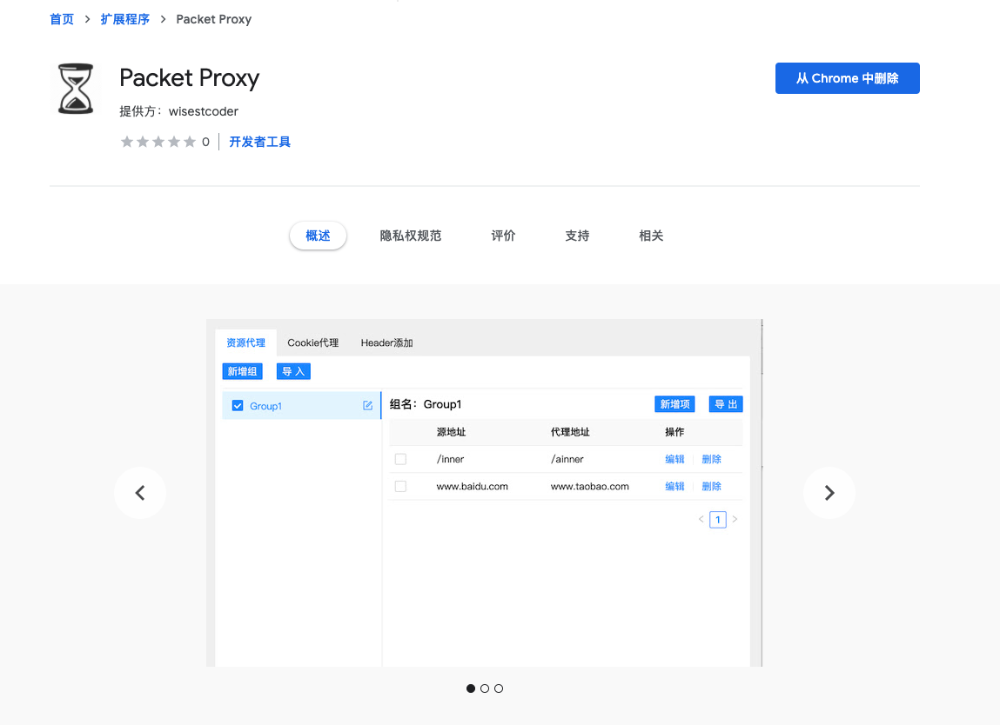
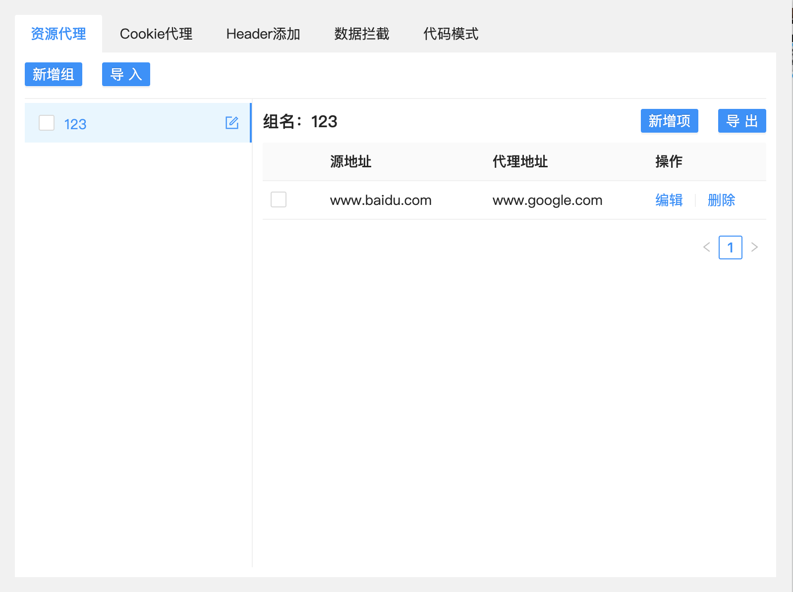
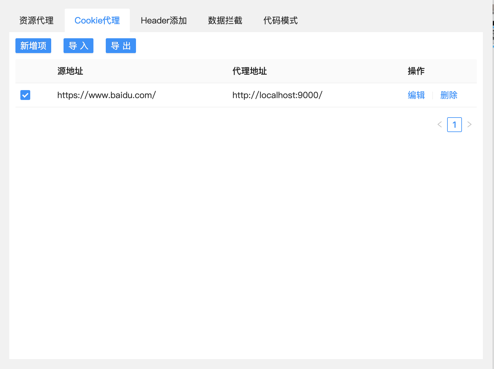
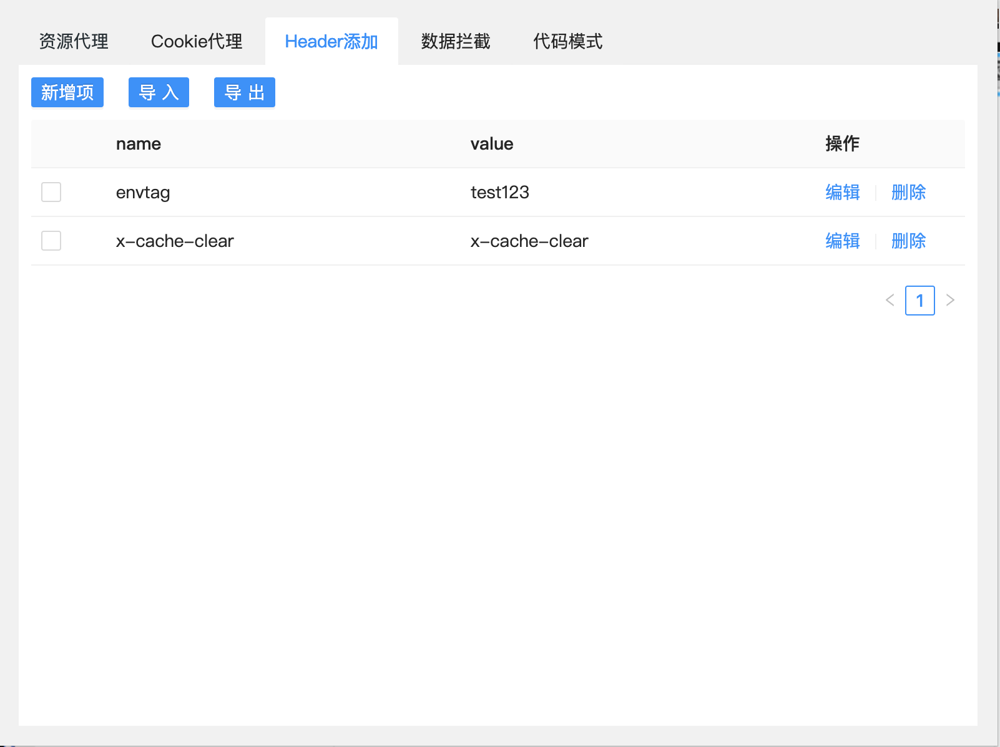
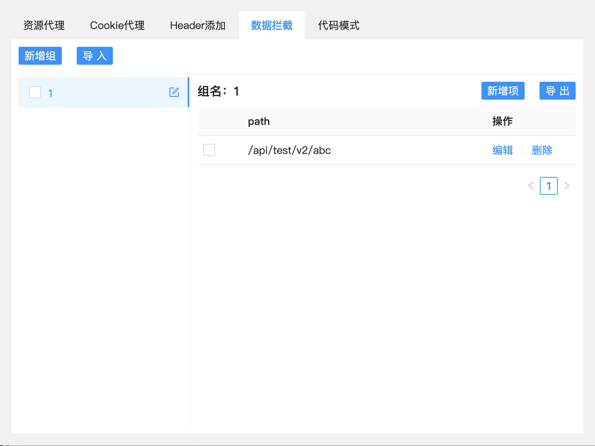
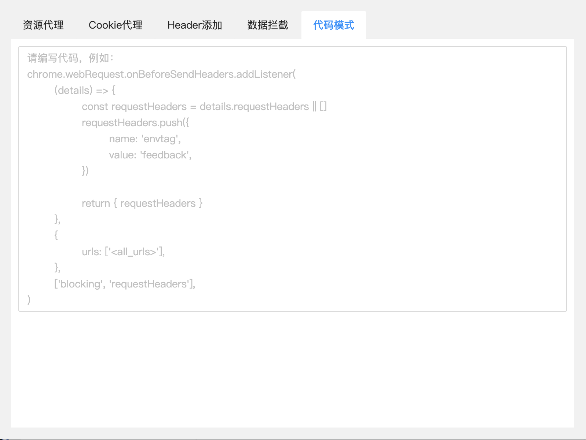

## packet-proxy

一款具有静态资源代理、接口转发、Cookie 代理等功能的 Chrome 浏览器插件

### 功能

- 支持静态资源代理
- 支持 Cookie 代理
- 支持资源分组
- 支持 JSON 导入导出

### 如何安装

打开chrome应用市场，搜索并安装，或者也可以直接下载目录下的packet-proxy.crx文件，并拖拽进扩展程序中

### 如何使用

#### 资源代理

1. 新建组，并启用
2. 添加代理路径（源地址 + 代理地址）；可以支持正则
3. 勾选复选框启用
4. 刷新相关的页面

#### Cookie 代理

1. 添加代理路径（源地址 + 代理地址）；其中源地址必须是一个合法且带协议的 https?地址
2. 勾选复选框启用
3. 打开或刷新源网址，会自动读取到源地址的 cookie
4. 打开代理的网址，会自动把源地址的 cookie 塞到代理网址下

#### header添加

#### 数据拦截

#### 代码模式

